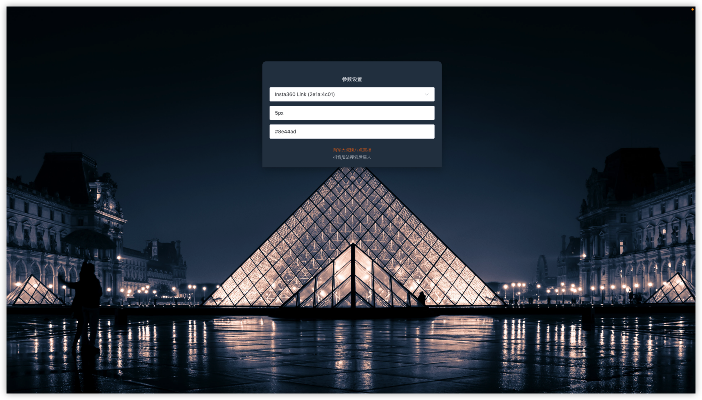
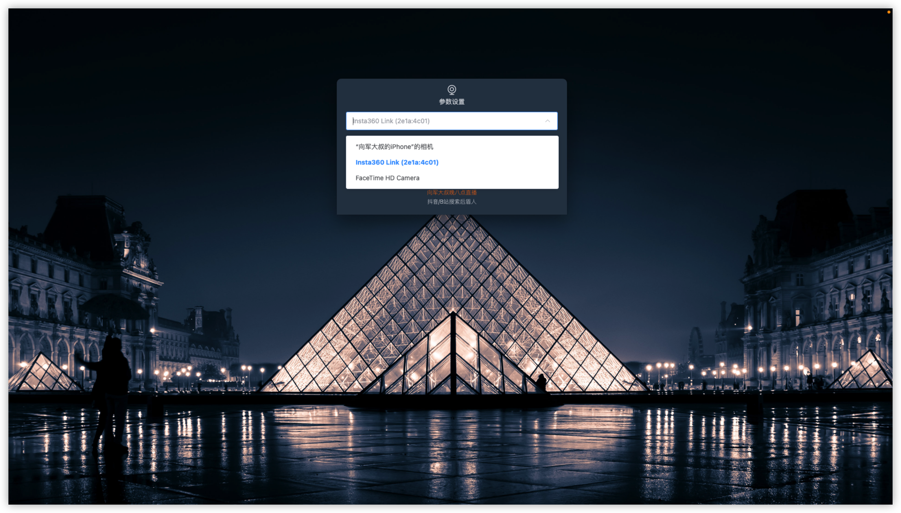

# 桌面摄像头

> 向军大叔每晚八点在 [抖音](https://live.douyin.com/houdunren) 和 [bilibli](https://space.bilibili.com/282190994) 直播

基于 Electron+Vue3+Vite 开发的桌面摄像头软件，方便直播录课、短视频拍摄等场景。

## 功能特点

- 电脑有多个摄像头时，支持更换摄像头
- 摄像头窗口置顶
- 配置边框宽度
- 定义边框颜色
- 支持 window、Mac 多平台

## 效果展示

摄像头角效果

支持多种参数的配置

支持多摄像头摄像头选择

